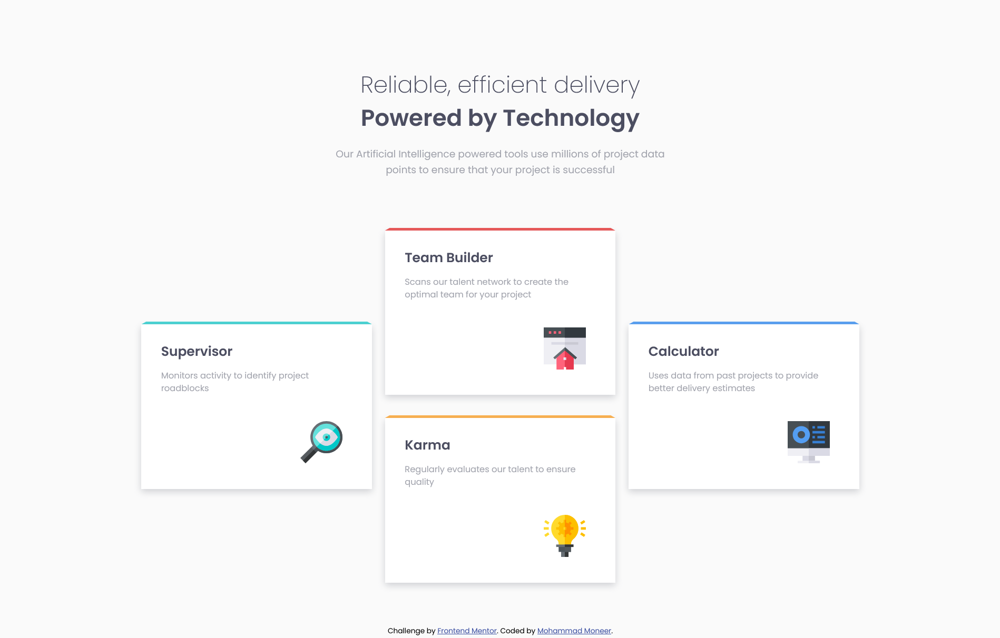

# Frontend Mentor - Four card feature section solution

This is a solution to the [Four card feature section challenge on Frontend Mentor](https://www.frontendmentor.io/challenges/four-card-feature-section-weK1eFYK). Frontend Mentor challenges help you improve your coding skills by building realistic projects.

## Table of contents

- [Overview](#overview)
  - [Screenshot](#screenshot)
  - [Links](#links)
- [My process](#my-process)
  - [Built with](#built-with)
  - [What I learned](#what-i-learned)
- [Author](#author)

## Overview
To get some details and background of this project visit the link below:
[Frontend Mentor | Four card feature section challenge](https://www.frontendmentor.io/challenges/four-card-feature-section-weK1eFYK)

### Screenshot

&nbsp;

### Links

- [GitHub Repository](https://github.com/Mohammad-Moneer/four-card-feature-section-master)
- [Live Demo](https://mohammad-moneer.github.io/four-card-feature-section-master/)

## My process

### Built with

- HTML
- CSS
- Grid

### What I learned

- Grid layout
- Semi transparent color
using semi transparent color for box-shadow
- transform-skew for Decorative Styling:
using "transform: skew" to add angled decorative lines to each feature card, creating a dynamic look that enhances the visual appeal.
- calc:
using the calc function in calculating the width after subtracting the horizontal margin.

## Author

- Frontend Mentor - [@Mohammad-Moneer](https://www.frontendmentor.io/profile/Mohammad-Moneer)